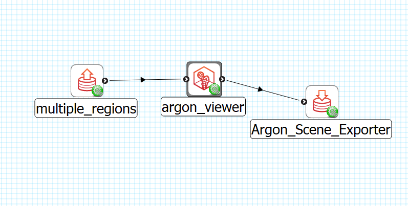
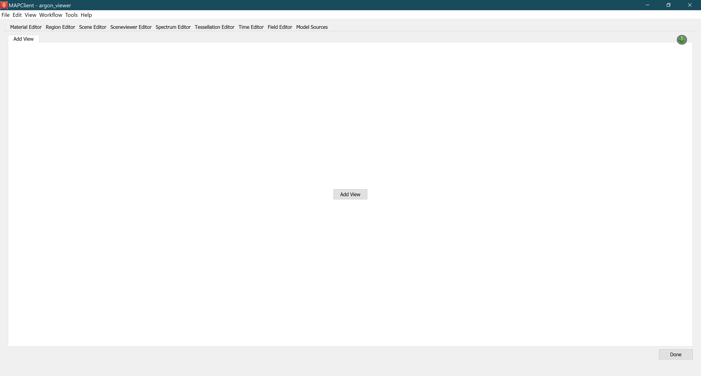
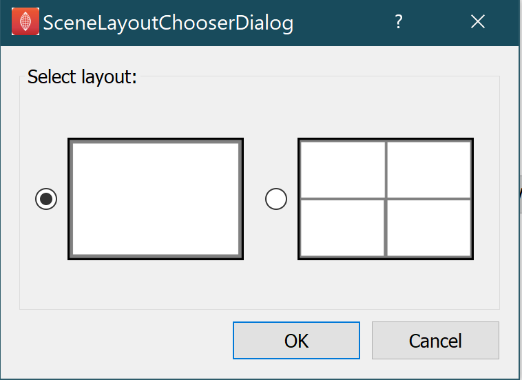

Argon Viewer Step
=================

The **Argon Viewer Step** is part of the software that is used in the collection of tools used for mapping data to scaffolds.

.. note::

   This project is under active development.

Overview
--------

The **Argon Viewer Step** tool 

Workflow Connections
--------------------

As shown in :numref:`fig-argon-viewer-step-workflow`, the **Argon Viewer Step** uses 1 inputs on the left:

1. A **File Chooser** to read from a exf or argon file.

It produces 1 output, also a Zinc EX file, which may be piped to other workflow steps:

1. The argon file.

.. _fig-argon-viewer-step-workflow:

   **Argon Viewer Step** workflow connections.
   
Whether you use the output in a further workflow step or not, on completion of the workflow step the output is written to a file in the workflow folder under the same name as the step with extension ".argon".

Background
----------

This **Argon Viewer Step**  is a bundle of **Zinc Weights**.

It includes:

1. Material Editor Weight;
2. Model Sources Weight;
3. Time Editor Weight;
4. Tessellation Editor Weight;
5. Spectrum Editor Weight;
6. Scene Editor Weight;
7. Sceneviewer Editor Weight;
8. Field Editor Weight;
9. Region Editor Weight.

The details of each weight can be found at `Zinc Weights Documentation <https://github.com/>`.

Usage
-----

Multi-Views
^^^^^^^^^^^

:numref:`fig-argon-viewer-initial` shows the **Argon Viewer Step** user interface just after loading 

.. _fig-argon-viewer-initial:

   Initial configuration with data projections shown before alignment.

The Weights tabs on the top lists the zinc weights can be used. 

Clicking *Done* saves the settings into an argon file then moving to the next workflow step.

Multi-Views
^^^^^^^^^^^

:numref:`fig-scene-layout-chooser` shows the **Argon Viewer Step** user interface

.. _fig-scene-layout-chooser:

   Scene layout chooser.
