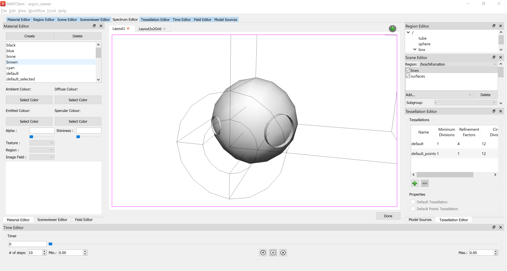
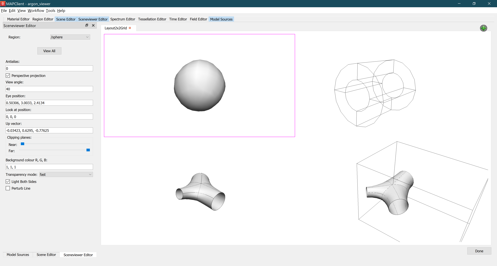

Argon Viewer Step
=================

The **Argon Viewer Step** is part of the software that is used in the collection of tools used for mapping data to scaffolds.

.. note::

   This project is under active development.

Overview
--------

The **Argon Viewer Step** is a general purpose visualization tool 
helps display and manage `Zinc` scenes. The output of this tool is an Argon file which can be used to generate WebGL files for visualization.

This document describes how to set up and use the **Argon Viewer** user interface in 
Mapping Tools. 

Workflow Connections
--------------------

As shown in :numref:`fig-argon-viewer-step-workflow`, the **Argon Viewer Step** uses 1 inputs on the left:

1. A **File Chooser** to read from a `Zinc library`` compatible EX files or an argon file.

It produces 1 output which may be piped to other workflow steps:

1. An argon file.

.. _fig-argon-viewer-step-workflow:

.. figure:: _images/argon-viewer-step-workflow.png
   :figwidth: 40%
   :align: center

   **Argon Viewer** workflow connections.
   
Whether you use the output in a further workflow step or not, on completion of the workflow step the output is written to a file in the workflow folder under the same name as the step with extension ".argon".

Background
----------

This **Argon Viewer**  is a bundle of **Zinc Weights**.

It includes:

1. Material Editor Weight;
2. Model Sources Weight;
3. Time Editor Weight;
4. Tessellation Editor Weight;
5. Spectrum Editor Weight;
6. Scene Editor Weight;
7. Sceneviewer Editor Weight;
8. Field Editor Weight;
9. Region Editor Weight.

The details of these weight can be found at `Zinc Weights Documentation <https://github.com/>`.

Install
-------

Requirements
^^^^^^^^^^^^

python >= 3.6

mapclient >= 0.16

opencmiss.zinc >= 3.6

opencmiss.zincwidgets >= 2.0

opencmiss.argon >= 0.3

pip install
^^^^^^^^^^^

This **Argon Viewer** can be installed from PyPi.org with the following command::

  pip install mapclientplugins.argonviewerstep

Usage
-----

To illustrate the use of Argon Viewer Step we will use 
a `multi view example workflow <https://github.com/mapclient-workflows/argon-viewer-step-docs-example>`_ 
(`download zip <https://github.com/mapclient-workflows/argon-viewer-step-docs-example/archive/refs/heads/main.zip>`_) 
which uses basic graphic shapes data.

Initial
^^^^^^^
:numref:`fig-argon-viewer-initial` shows the **Argon Viewer** user interface just after loading. 

.. _fig-argon-viewer-initial:

.. figure:: _images/argon-viewer-initial.png
   :align: center

   Initial **Argon Viewer** user interface after loading.

The Weights tabs on the top lists the zinc weights can be used. 
In the middle of the user interface is a tab widget contains views. Argon Viewer allows users to create
multiple views and each view can have different number of sceneviewer widget. By clicking the `Add View`
button in the middle or the green plus button on the top right, a Scene Layout Chooser Dialog will pop out
letting user to select layout for the view.

:numref:`fig-scene-layout-chooser` shows the Scene Layout Chooser Dialog, which can select the number 
of sceneviewer widget in the view.

.. _fig-scene-layout-chooser:

.. figure:: _images/scene-layout-chooser.png
   :align: center

   **Scene Layout Chooser Dialog** for selecting view layout.

There are two types of layout can be selected. One full layout with only one sceneviewer widget for single view, and a grid layout
with four small sceneviewer widget for multiple views.

Single View
^^^^^^^^^^^
:numref:`fig-argon-viewer-single-view` shows the **Argon Viewer Step** user interface with single sceneviewer.

.. _fig-argon-viewer-single-view:

   **Argon Viewer** user interface for single view.

Single View is for user to focus scenes from one region.

Multi-Views
^^^^^^^^^^^

:numref:`fig-argon-viewer-multiviews` shows the **Argon Viewer Step** user interface with multiple views.
.. _fig-argon-viewer-multiviews:

   **Argon Viewer** user interface for multiple Views.

Argon Viewer allows user to view multiple scenes at the same time. There will be a purple border
instruct which sceneviewer is choosen, and other widgets such as Scene Editor widget and Sceneviewer
Editor widget shows the infomation of the choosen sceneviewer. 
The content of choosen sceneviewer can be edited by selecting regions in the Sceneviewer Editor widget,
so user can view scenes from different regions or view the graph through different angle
at the same time.

Clicking *Done* saves the settings into an argon file then moving to the next workflow step.
